# GreenLab-SmartFlowerpot
Full-stack design and implementation of smart flowerpot as part of Cisco NAG IoT 2017 competition.

Contributors: @AlesKubicek, @VojtechKaniok

Video 1: [Design and PCB manufacturing](https://drive.google.com/file/d/0B7qzAMdT2lraRVIxd191VTBpYkk/view?usp=sharing)

Video 2: [Final version](https://drive.google.com/file/d/0B7qzAMdT2lraQzZTQk52a2l5a1U/view?usp=sharing)

### 3D design
- Tinkercad
- 3D printing

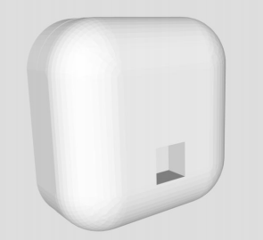
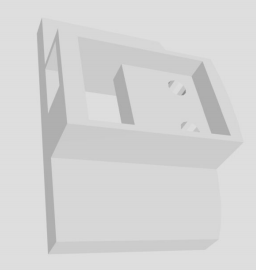
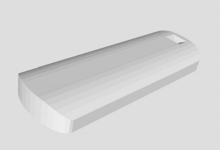
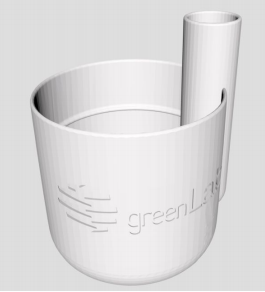
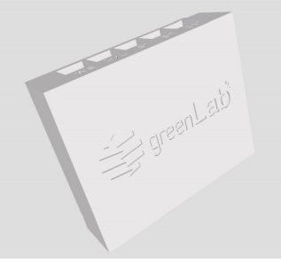

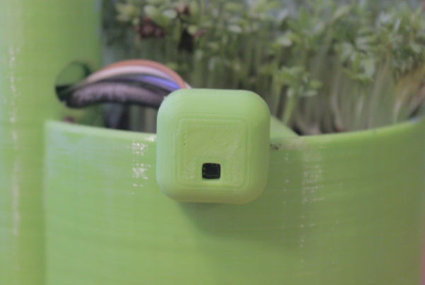
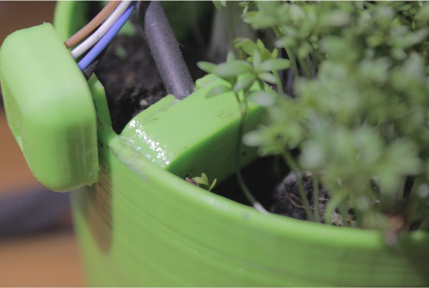
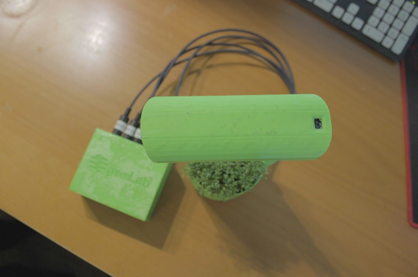
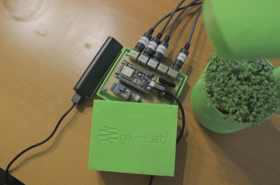

### PCB design
- Eagle
- DIY PCB manufacturing (UV light method)

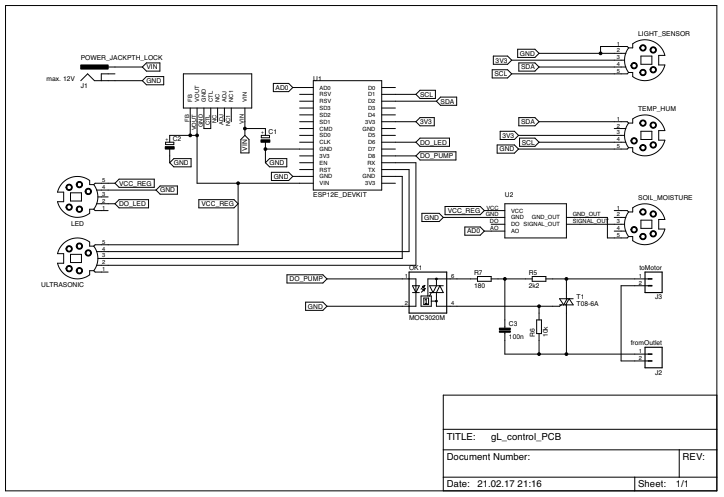
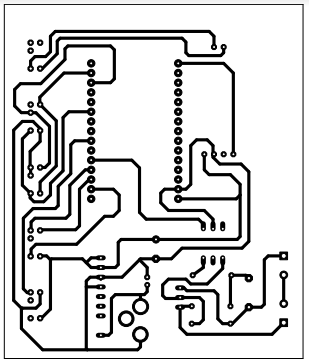

### Web application
- PHP, MySQL, HTML/CSS/JS/AJAX
- Highcharts
- Statistics available for download as .csv file

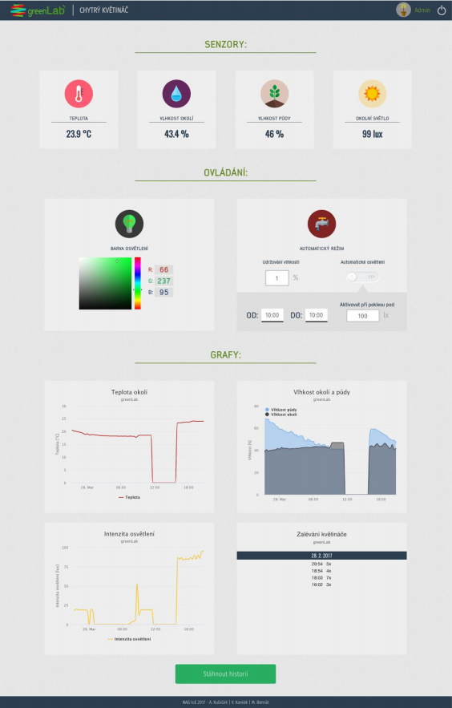

### Android application
- Making use of responsive design of the web application 
- Notification functionality (when sensor values out of limits)

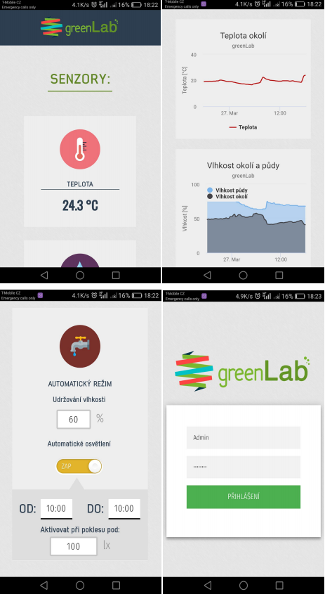
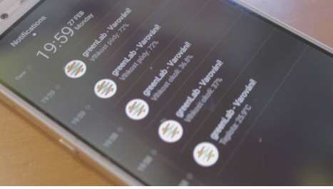
